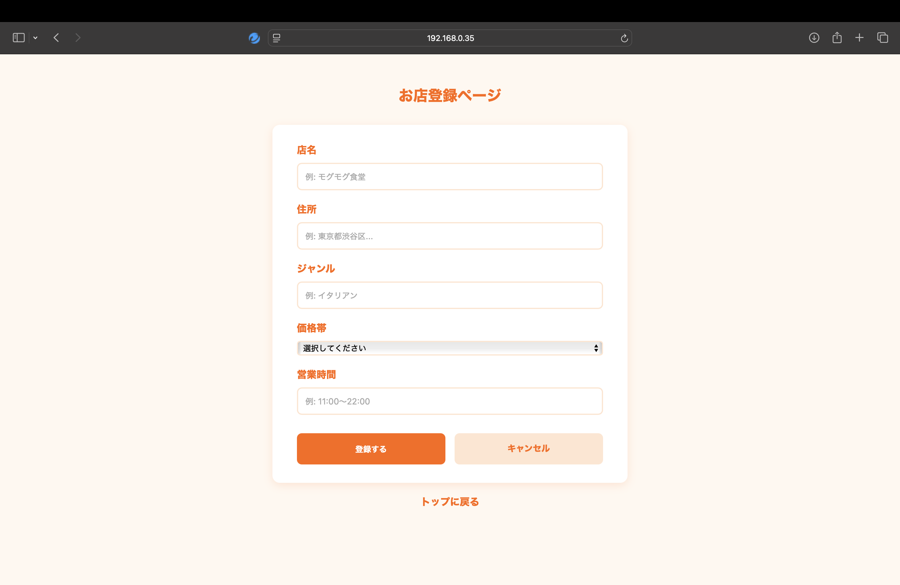
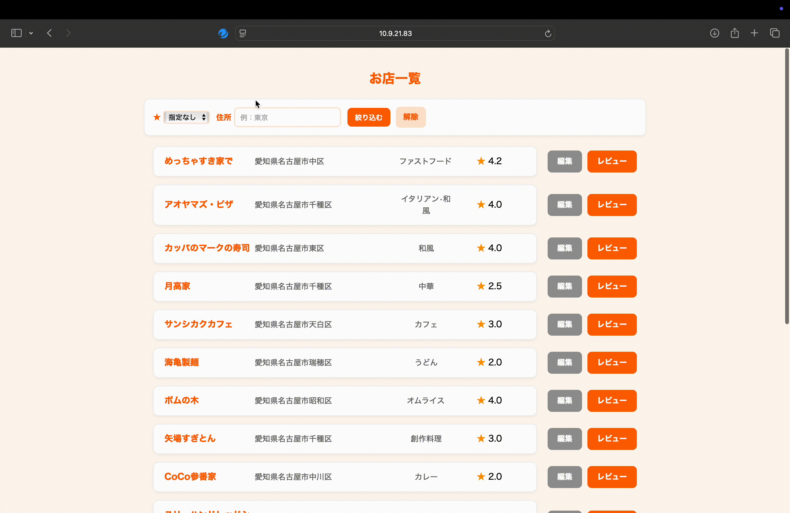
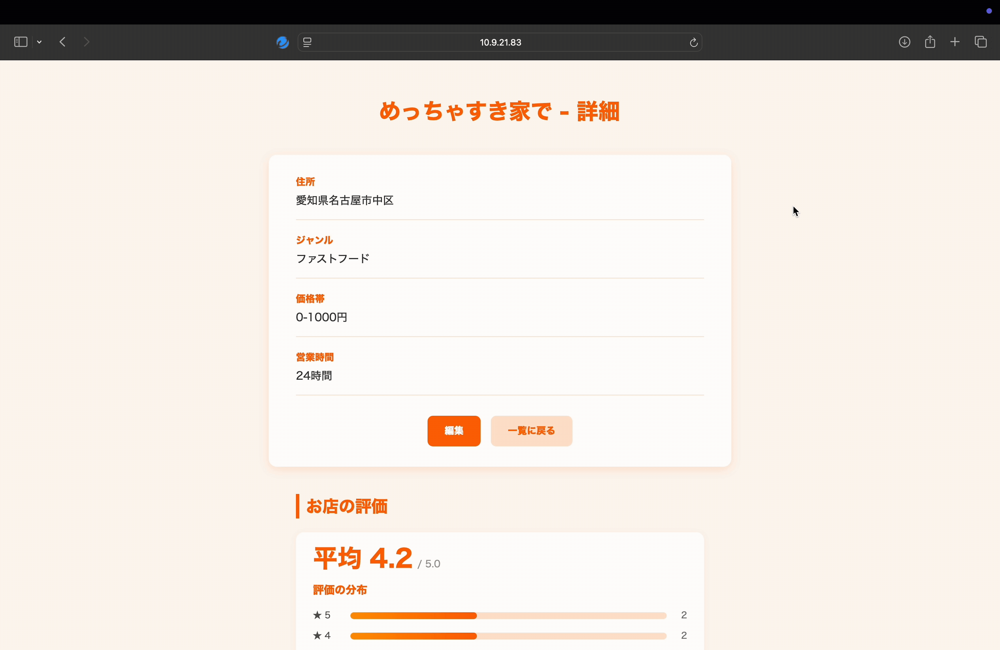
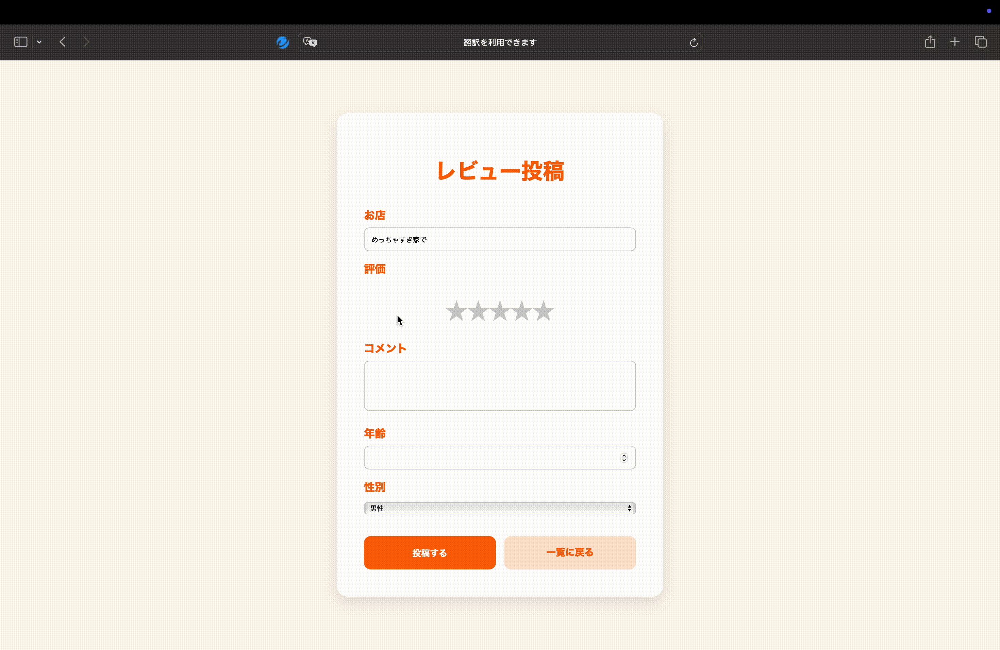
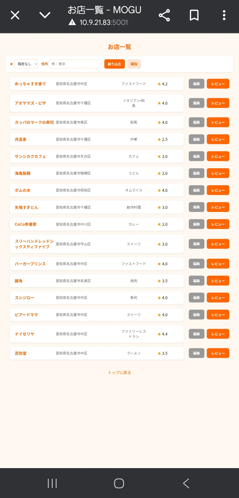

# MOGUMOGUレビュー

## アプリ概要
- MOGUMOGUレビューは、訪れた飲食店や気になった飲食店を自由に登録し、レビューを記録・閲覧できるアプリケーションである。
- お店ごとに情報を登録でき、さらに利用者の評価やコメントを通して、飲食店の特徴を知ることができる。
- 同じネットワーク内であれば、みんなで同じサーバーに入り情報を共有できる。

## アプリ画面
 
- お店登録画面
> - 「トップ画面」から「お店登録」を押すと表示される。
> - 自分で、好きなお店を登録できる。
> - 記入例が枠の中に表示されているため、ユーザーがどのように記入すればいいか分かりやすくなっている。

 
- お店一覧画面(GIFあり)
> - 「トップ画面」から「お店一覧」を押すと表示される。
> - ユーザーが登録したお店を一覧表示。
> - 新しい順で表示されるため、最近の流行りなどが分かりやすくなっている。
> - 評価◯以上、住所で絞り込むことができる。

 
- お店詳細画面(GIFあり)
> - 「お店一覧」から「お店名」を押すと表示される。
> - お店の詳細情報と、ユーザーのレビューを表示。
> - 評価の分布をわかりやすく表示している。
> - スクロールして複数のレビューを閲覧できる。

 
- レビュー画面(GIFあり)
> - 「お店一覧」から「レビュー」を押すと表示される。
> - 直感的な操作で星の評価をすることができる
> - 好きなようにコメントを記入できる。


- スマートフォンの画面
> - スマートフォンでも動作する。
> - 同じネットワーク内であれば、サーバーに入ることができる。


## 動作条件

```bash
python 3.13 or higher

# python lib
Flask==3.0.3
peewee==3.17.7
```

## 使い方

bashで以下のコマンドを入力する
```
$ python app.py
```
入力したあと、エラーがないか確認して
```
http://localhost:5001
```
にアクセスする

同じネットワーク内の誰かがサーバーを開いていれば
```
http://サーバー開設者のIPアドレス:5001
```
でアクセスできる

### お問い合わせ先

| 機能 | GitHubアカウント |
| --- | ------------- |
| レビュー登録画面 | UNO1013 | 
| お店登録画面・お店編集画面 | sou-1014 | 
| トップページ・お店詳細画面 | hypnen-cmd | 
| お店一覧画面 | papettosunsun |
| その他 | T-K-T-K-T |
