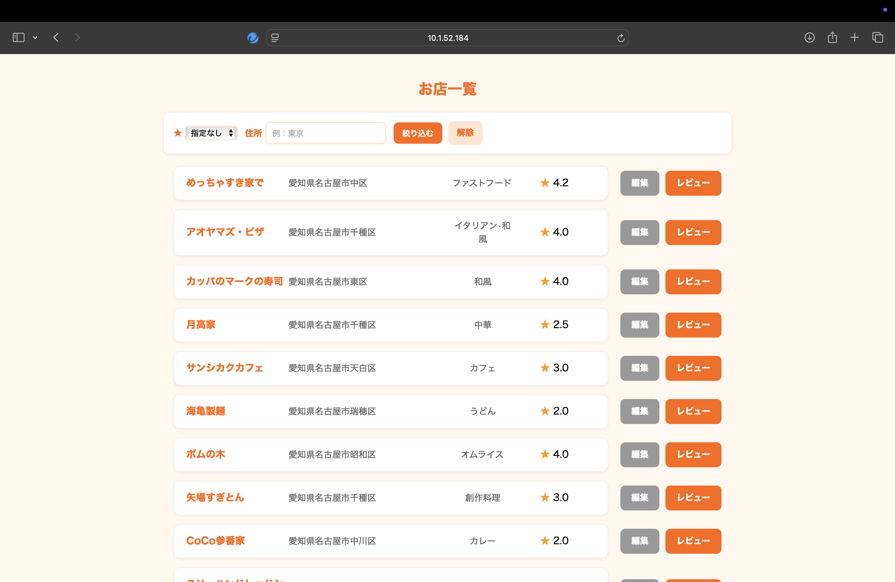
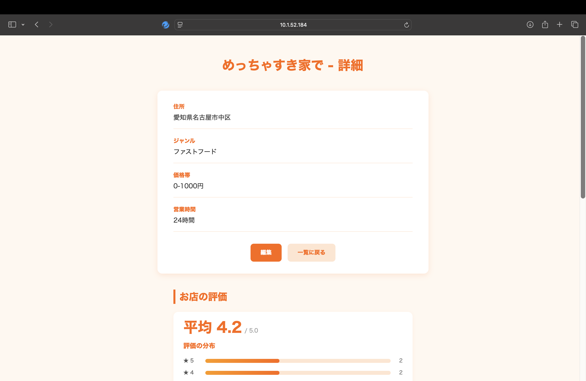
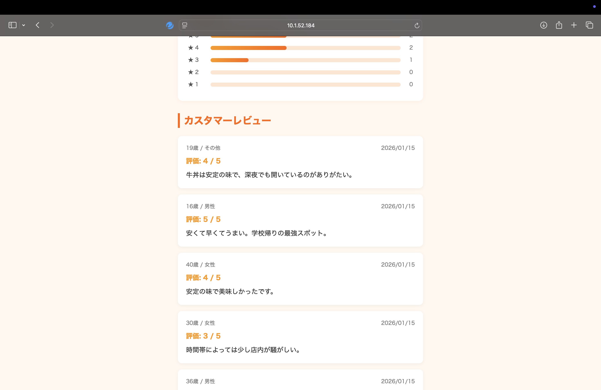

# MOGUMOGUレビュー

## アプリ概要
MOGUMOGUレビューは、ユーザーが訪れた飲食店や気になった飲食店を自由に登録し、レビューを記録・閲覧できるアプリケーションである。
お店ごとに「店名・住所・ジャンル・価格帯・営業時間」などの基本情報を登録でき、さらに利用者の評価やコメントを通して、飲食店の特徴を可視化することができる。

## アプリイメージ
 
- お店登録画面
> - トップ画面から「お店登録」を押すと表示される。
> - 「お店名、住所、ジャンル、価格帯、営業時間」を登録できる。
> - 記入例が枠の中に表示されているため、ユーザーがどのように記入すればいいか分かりやすくなっている。

 
- お店一覧画面
> - トップ画面から「お店一覧」を押すと表示される。
> - 「お店名、住所、ジャンル、評価、編集ボタン、レビューボタン」を表示。
> - 評価◯以上、住所で絞り込むことができる。
> - お店の名前を押したら「お店詳細」に遷移。
> - 編集ボタンを押すと「編集」画面に遷移する。
> - レビューボタンを押すと「レビュー」画面に遷移する。

 
- お店詳細画面
> - 「お店名、住所、ジャンル、価格帯、営業時間、平均評価」「コメント、評価、年齢、性別、投稿日」を表示。
> - 評価の分布をわかりやすく表示している。
> - スクロールして複数のレビューを閲覧できる。


 
- レビュー画面
> - 「お店名、評価、年齢、性別、コメント」を登録。
> - 直感的な操作で星の評価をすることができる


## 動作条件

```bash
python 3.13 or higher

# python lib
Flask==3.0.3
peewee==3.17.7
```

## 使い方

bashで以下のコマンドを入力する
```
$ python app.py
```
入力したあと、エラーがないか確認して
```
http://localhost:5001
```
にアクセスする

同じネットワーク内の誰かがサーバーを開いていれば
```
http://サーバー開設者のIPアドレス:5001
```
でアクセスできる

### お問い合わせ先

| 機能 | GitHubアカウント |
| --- | ------------- |
| レビュー登録画面 | UNO1013 | 
| お店登録画面・お店編集画面 | sou-1014 | 
| トップページ・お店詳細画面 | hypnen-cmd | 
| お店一覧画面 | papettosunsun |
| その他 | T-K-T-K-T |
